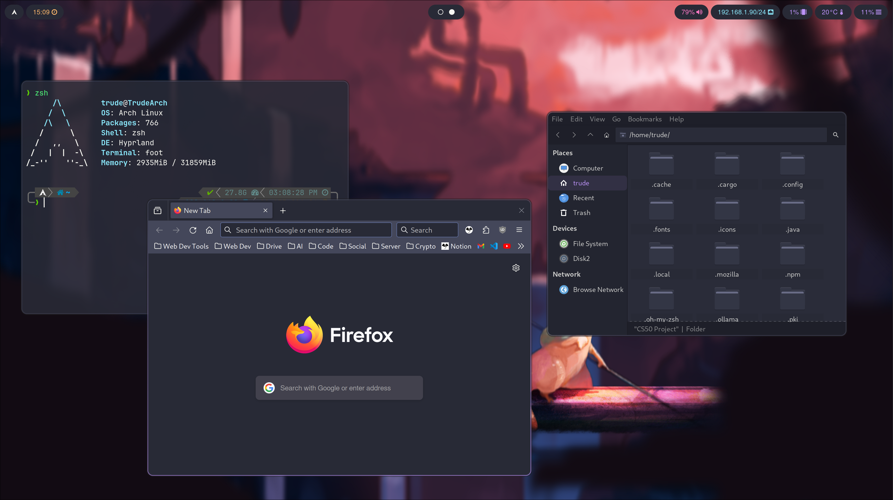
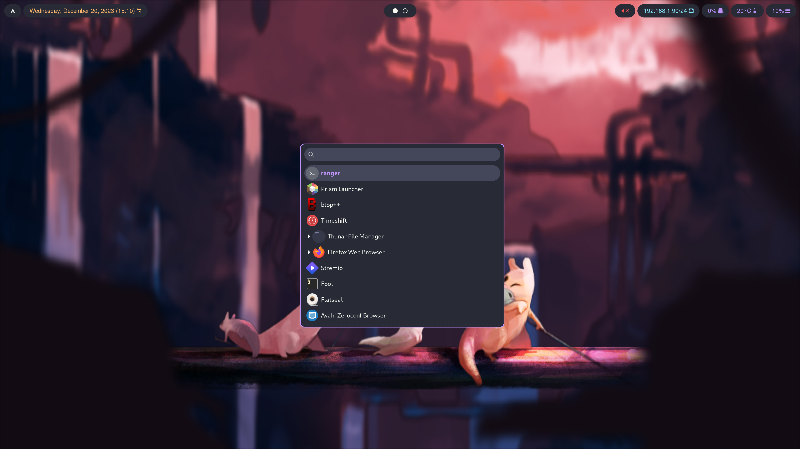
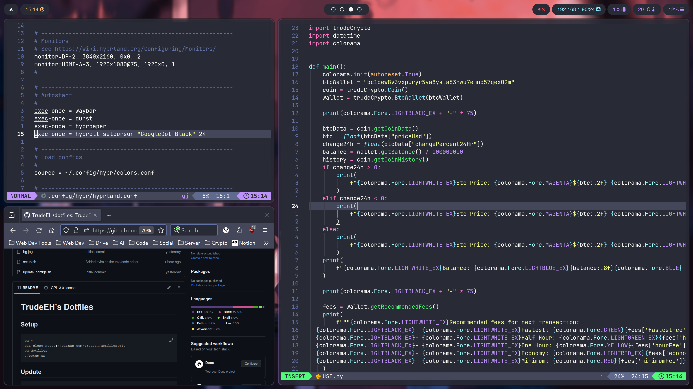

# TrudeEH's Dotfiles






## Setup
```sh
cd ~
git clone https://github.com/TrudeEH/dotfiles.git
cd dotfiles
./setup.sh
```
## Update
```sh
cd ~/dotfiles
git fetch --all
git reset --hard origin/master
./update_configs.sh
```
If an update changes a dependency, run `setup.sh` again.
